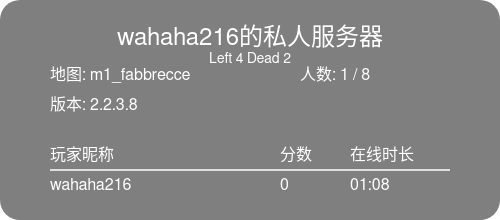

# @wahaha216/koishi-plugin-a2s

[](https://www.npmjs.com/package/@wahaha216/koishi-plugin-a2s)

使用 A2S 协议获取起源引擎游戏信息

## 使用方法

```tex
a2s <ip>
```

开启自动识别后，将识别以下格式

```tex
connect <ip>
```

## 效果



## 存储服务器

### 获取存储的所有服务器的状态

同时会尝试请求服务器获取游戏信息

```tex
a2s_server
```

### 添加服务器

```tex
a2s_server add <服务器名称> <ip>
```

同时添加分组

```tex
a2s_server add <服务器名称> <ip> -g <分组名称>
```

### 编辑服务器

```tex
a2s_server edit <服务器名称> <ip>
```

同时修改分组

```tex
a2s_server edit <服务器名称> <ip> -g <分组名称>
```

### 删除服务器

```tex
a2s_server del <服务器名称>
```

### 获取服务器信息

```tex
a2s_server info <服务器名称或序号>
```

当参数为整数时，会尝试转成下标进行查询，查不到则视作名称查询

例如：添加了 5 个服务器，使用 `a2s_server info 2` 时，会尝试获取第二个服务器的信息

### 获取服务器列表

不会尝试请求获取实际的游戏信息，仅返回添加时的 `名称` 和 `ip`

```tex
a2s_server list
```
